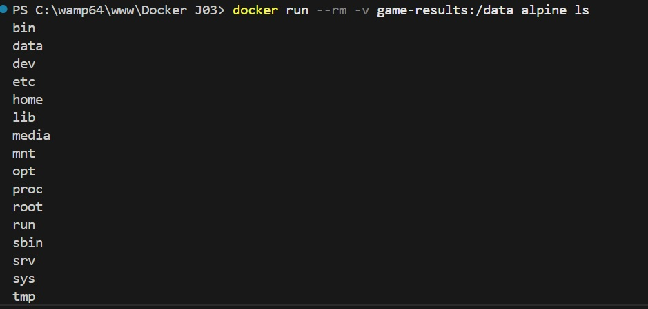
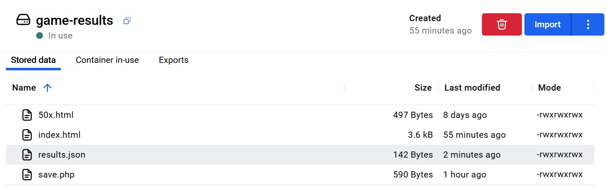
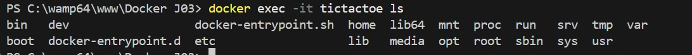
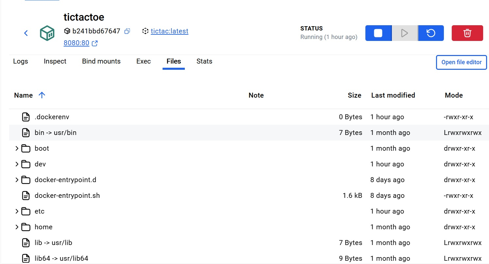
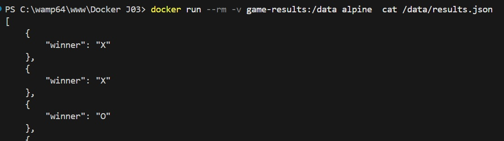
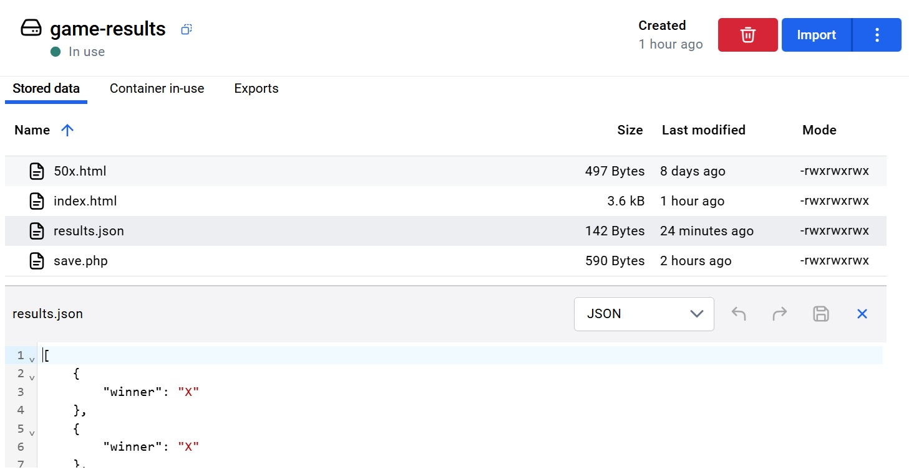
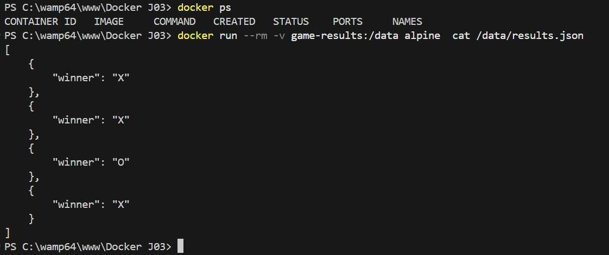

# Creation Volume game-results

# Creation image tictac

# Lancement du conteneur

# Affichage volumes existants

# Affichage contenu volume

# Affichage contenu conteneur

# Affichange results.json

# JSON apres arret du conteneur:

